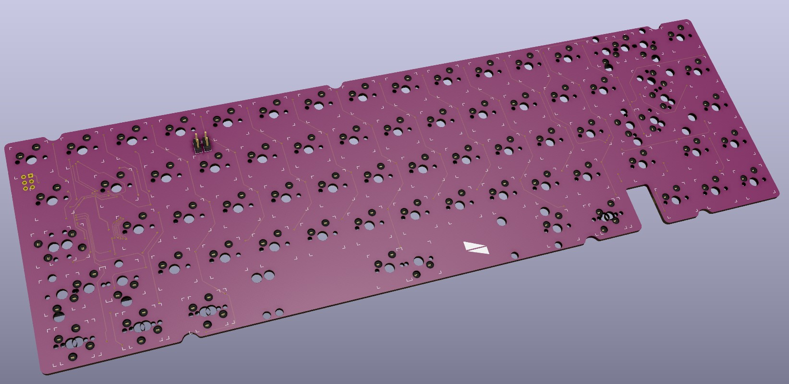
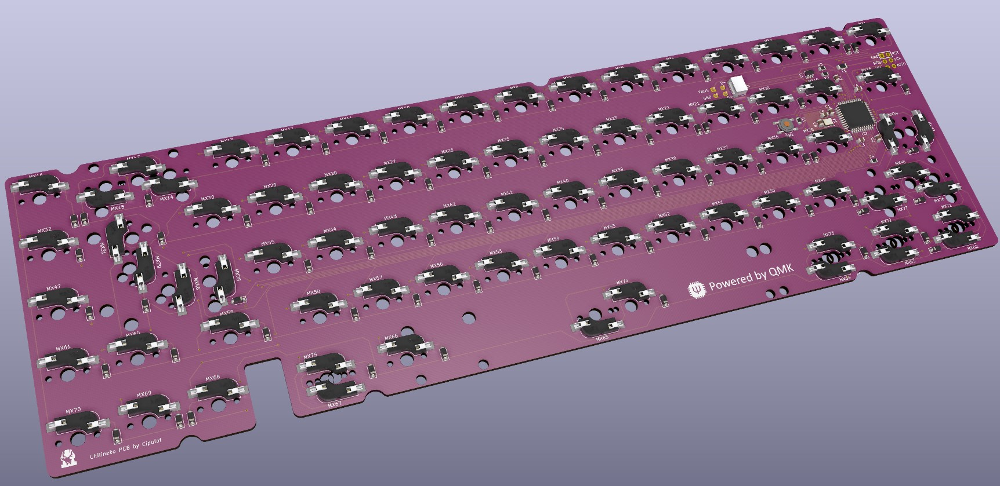
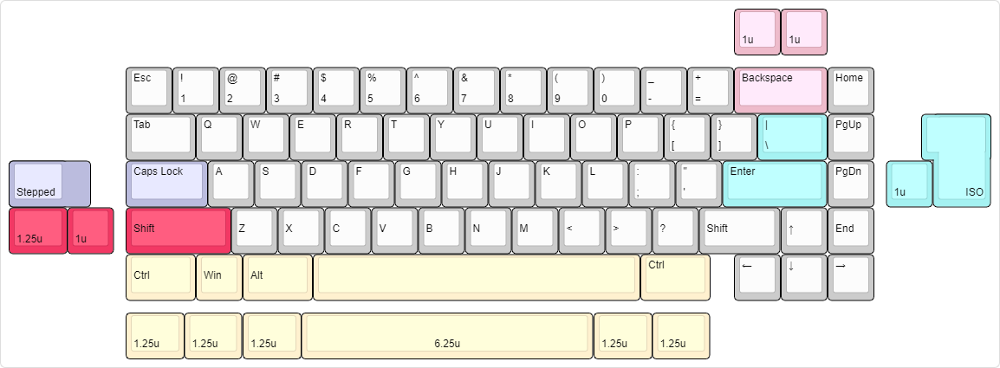

# Chilineko

## Features

- Single piece tray case
- O-ring gasket mount (Friction fit)
- [Unified Daughterboard](https://github.com/ai03-2725/Unified-Daughterboard)
- QMK firmware and VIA
- PCB designed with KiCAD 5.1.10

## Layouts

## Notes

- All files are to be used at your own risk
- As for stabilizers, only PCB snap-ins are supported

Read the files provided in the Resources section for further information.

## Resources

- Introductory document and PCB Order guide [here](https://drive.google.com/drive/folders/1Ks_figqYfMSzfUTn7lY1eMxK4qDpxoYU?usp=sharing)
- Personal KiCad Part Collection with already included components from most used one in keyboard [here](https://github.com/cipulot/cipulot_kicad_parts) (already included as a submodule in this repository)